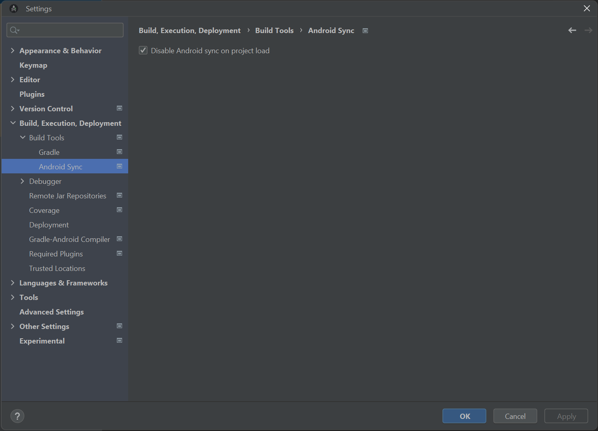

# Disable Android Sync IDE Plugin

This IDE plugin allows disabling the Android Sync on project load. This is mostly in response to the Google issue [b/299322773](https://issuetracker.google.com/issues/299322773).

## Usage
Once this plugin is installed, it can be found as a setting under the IntelliJ setting panel.



This setting prevents Android projects from starting a Gradle configuration when the project has loaded on IDE start.

## Build
To build and test this plugin, you can run the following gradle command:
```
./gradlew runIde
```

With this command, an instance of Android Studio should start, with the setting disabled.

## Status
This project is still under developement, and contributions are welcome.